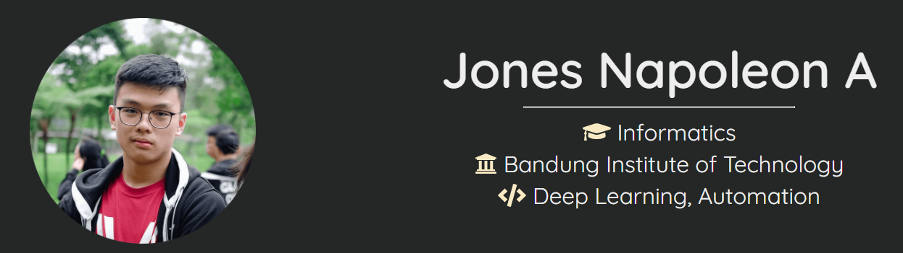

# Official Jones Napoleon

### Hi there 👋

## Professional Experience

1 **Garena** - Backend Engineer

- Responsible for the backend system of AOV PSSGradeyout and AOV Mganga Supersale Event.
- Tech stack: _Django, MySQL, Redis_.

2 **Dans Multi Pro** - Frontend Engineer

- Responsible for ?
- Tech stack: _React, ?_

3 **Sportigo** - Frontend Engineer

- Completely responsible for the [Competition Web Application](http://competition.sportigo.id).
- Tech stack: _React, Redux, TypeScript, Material UI_.

4 **SRE ITB** - Fullstack Web Developer

- Compeletely responsible for the [web application](https://sreitb.com).
- Tech stack: _React, Firebase, Express_.

5 **AISC 2021** - Lead Developer

- Supervise fellow developers and responsible for the [web application](https://jonesnapoleon.com).
- Tech stack: _React, Firebase, Express_.

6 **Arkavidia** - Backend Engineer

- Responsible for the backend system of the Preevent and Checkin system
- Tech stack: _Django_

7 **TEDxITB** - Frontend Engineer

- Responsible for all UI components, image management, and SEO utils.
- Tech stack: _React_

## Highlighted product

1 **NIM FINDER ITB**

- Try using it [here](https://jonesnapoleon.com/nimfinder)
- Read more on [here](https://jonesnapoleon.com/posts/nim-finder)

## Get in touch

- Personal page: https://jonesnapoleon.com
- Linkedin: https://linkedin.com/in/jonesnapoleon/
- Instagram: https://instagram.com/jonesnapoleon/
